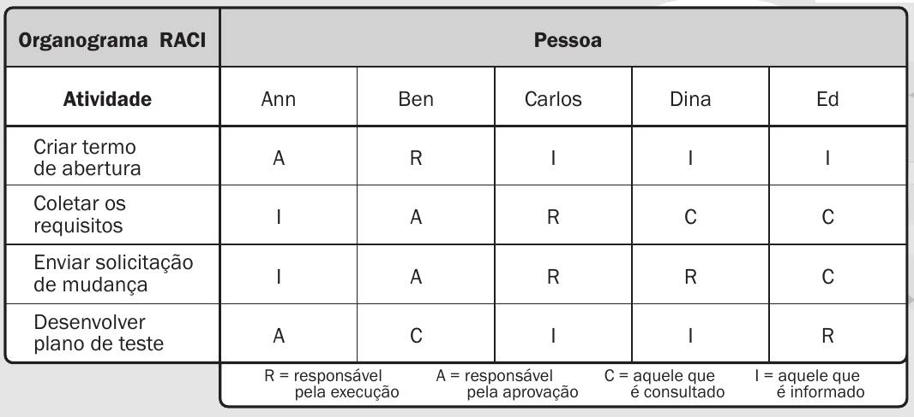

# Planejamento

> A fase de planejamento na gerência de projetos é um momento onde os detalhes do projeto são minuciosamente definidos para garantir uma execução bem-sucedida. 
> Durante essa etapa, os gerentes de projeto e suas equipes elaboram um plano abrangente que aborda aspectos como cronograma, orçamento, recursos necessários, riscos identificados e métodos de controle. 
> O objetivo é criar uma estrutura que guiará as atividades ao longo do projeto, garantindo que metas sejam alcançadas de maneira eficiente. 
> O plano de projeto não apenas define as tarefas específicas e suas interdependências, mas também estabelece critérios de sucesso e indicadores de desempenho. 
> A qualidade do planejamento influencia diretamente a capacidade da equipe em cumprir prazos, alocar recursos eficientemente e lidar com desafios que possam surgir durante a execução.

# Estrutura do Documento

- [Fase de Planejamento](#planejamento)
- [Escopo do Projeto](#escopo-do-projeto)
- [Estrutura Analítica do Projeto](#estrutura-analítica-do-projeto)
- [Matriz de Responsabilidades](#matriz-de-responsabilidades)
- [Cronograma do Projeto](#cronograma-do-projeto)
- [Orçamento do Projeto](#orçamento-do-projeto)
- [Planos de Gerenciamento](#planos-de-gerenciamento)
  - [Plano de Qualidade](#plano-de-qualidade)
  - [Plano de Aquisição](#plano-de-aquisição)
  - [Plano de Comunicação](#plano-de-comunicação)
  - [Plano de Riscos](#plano-de-riscos)

-----
```diff
+ Tarefa 04:
+ Escopo e Estrutura Analítica do Projeto
```

# Escopo do Projeto

......  COLOQUE AQUI O SEU TEXTO ......

> O escopo do projeto define os limites, objetivos e entregáveis do projeto, estabelecendo clareza sobre o que será realizado e o que está excluído do escopo. 
> O escopo assegura a alocação adequada de recursos, evita desvios dos objetivos do projeto e garante que as expectativas dos stakeholders sejam atendidas. 
> A definição do escopo inclui documentação detalhada dos requisitos, restrições e premissas do projeto. 
> Ao longo do ciclo de vida do projeto, a gestão do escopo também inclui o controle de mudanças, garantindo que qualquer ajuste seja avaliado quanto ao seu impacto e aprovado de maneira adequada. 
> Utilize como referência a documentação existente na [Fase de Iniciação](/docs/01-iniciacao).

# Estrutura Analítica do Projeto

......  COLOQUE AQUI O SEU TEXTO ......

> A Estrutura Analítica do Projeto (EAP) proporciona uma representação hierárquica atividades que compõem um projeto. 
> Organizando o escopo do projeto em componentes gerenciáveis e compreensíveis, a EAP facilita a decomposição do trabalho em partes menores, tornando mais fácil o planejamento, a atribuição de responsabilidades e o monitoramento do progresso. 
> Cada elemento na estrutura representa uma parcela específica do trabalho a ser realizado, proporcionando clareza sobre as inter-relações entre as diferentes partes do projeto. 
> A EAP serve como a base para a criação do cronograma do projeto, a alocação de recursos e a identificação de dependências. 
> Essa abordagem estruturada contribui significativamente para o sucesso do projeto, garantindo uma compreensão abrangente do escopo e uma base sólida para a gestão eficaz do trabalho ao longo do ciclo de vida do projeto.

> Crie uma nova imagem da Estrutura Analítica do Projeto. Não se esqueça de adicionar o documento editável no repositório.


> Softwares recomendados: 
> * [WBS Schedule Pro (Demo)](https://www.criticaltools.com/)
> * [Draw.io](https://app.diagrams.net/)
> * [ProjectLibre](https://www.projectlibre.com/)

### Documento Editável

> Você deve atualiza o seguinte link (ou link correspondente), como o arquivo editável de geração da WBS:
- [Estrutura Analítica do Projeto - Editável](artefatos/estrutura_analitica_projeto.wbs)

```diff
+ Tarefa 04:
+ Fim da seção a ser atualizada.
```

-----
```diff
+ Tarefa 05:
+ Matriz de Responsabilidades (RACI)
```

# Matriz de Responsabilidades

......  COLOQUE AQUI O SEU TEXTO ......

> A Matriz de Responsabilidades é uma ferramenta para definir e indicar as responsabilidades de cada membro da equipe em relação às atividades do projeto. 
> Também conhecida como RACI (Responsável, Aprovador, Consultado e Informado), essa matriz atribui papéis específicos a cada envolvido, indicando quem é responsável pela execução de uma tarefa, quem deve aprovar, quem precisa ser consultado e quem deve ser mantido informado. 
> Ao criar uma visão visual e estruturada das responsabilidades, a matriz RACI minimiza ambiguidades e conflitos de papel.
> Essa ferramenta não apenas esclarece as expectativas em termos de contribuições individuais, mas também contribui para um ambiente de trabalho mais organizado e transparente, resultando em uma gestão de projeto mais eficaz e bem-sucedida.

> Informações Adicionais:
> * **R**esponsible -> Executor (pessoa(s) que executará(ão)/desenvolverá(ão) a atividade)
> * **A**ccountable -> Responsável (pessoa responsável por aprovar a atividade)
> * **C**onsulted   -> Consultado (especialista consultado sobre a atividade ou parte dela)
> * **I**nformed    -> Informado (pessoas interessadas no projeto que devem ser informadas sobre a execução).
> 
> Link de auxílio: https://www.forbes.com/advisor/business/raci-chart/

> Crie uma nova imagem da Estrutura Analítica do Projeto. Não se esqueça de adicionar o documento editável no repositório.




### Documento Editável

> Você deve atualiza o seguinte link (ou link correspondente), como o arquivo editável da Matriz RACI:
- [Matriz de Responsabilidades (RACI) - Editável](artefatos/matriz-raci.docx)

```diff
+ Tarefa 05:
+ Fim da seção a ser atualizada.
```

-----
```diff
+ Tarefa 07:
+ Cronograma do Projeto
```

# Cronograma do Projeto

......  DESCREVA EM LINHAS GERAIS O CRONOGRAMA DO SEU PROJETO AQUI ......

> O cronograma do projeto fornece uma representação temporal detalhada de todas as atividades, marcos e eventos ao longo do ciclo de vida do projeto. 
> Elaborado durante o planejamento, o cronograma é uma ferramenta que oferece uma visão das interdependências entre as tarefas, alocando recursos e definindo prazos para as entregas.
> Utilizando técnicas como a análise de rede (PERT/CPM) e estimativas de duração, o cronograma ajuda na identificação de caminhos críticos, permitindo aos gestores de projeto otimizar recursos, antecipar potenciais atrasos e tomar decisões. 
> Além disso, o cronograma serve como um guia para monitorar o progresso, comunicar efetivamente com a equipe e as partes interessadas, e ajustar estratégias para garantir a conclusão bem-sucedida do projeto dentro dos prazos estabelecidos.

### Documento Editável

> Você deve atualiza o seguinte link (ou link correspondente), como o arquivo editável do Cronograma do Projeto:
- [Cronograma e Orçamento do Projeto - Editável](artefatos/cronograma_orcamento.pod)

```diff
+ Tarefa 07:
+ Fim da seção a ser atualizada.
```

-----
```diff
+ Tarefa 08:
+ Orçamento do Projeto
```

# Orçamento do Projeto

......  DESCREVA EM LINHAS GERAIS O ORÇAMENTO DO SEU PROJETO AQUI ......

> O orçamento do projeto envolve a estimativa e alocação de recursos financeiros necessários para a execução bem-sucedida do projeto, abrangendo custos diretos e indiretos, despesas operacionais, investimentos em equipamentos, pessoal, entre outros. 
> O desenvolvimento do orçamento deve considerar variáveis como riscos, imprevistos e mudanças no escopo. 
> Uma vez estabelecido, o orçamento serve como guia para a utilização eficiente dos recursos financeiros ao longo do projeto. 
> A gestão do orçamento não apenas ajuda a controlar os custos, mas também fornece transparência e prestação de contas, permitindo que gestores tomem decisões informadas e evitem surpresas financeiras ao longo do ciclo de vida do projeto. 
> Assim, o orçamento contribui para o sucesso do projeto, garantindo a viabilidade econômica e a entrega dentro das expectativas financeiras estabelecidas.

### Documento Editável

> Você deve atualiza o seguinte link (ou link correspondente), como o arquivo editável do Orçamento do Projeto:
- [Cronograma e Orçamento do Projeto - Editável](artefatos/cronograma_orcamento.pod)

```diff
+ Tarefa 08:
+ Fim da seção a ser atualizada.
```

# Planos de Gerenciamento

> Os planos de gerenciamento do projetos consolidam as diretrizes e estratégias para a execução bem-sucedida de um empreendimento. 
> Ele abrange diversos aspectos, como escopo, cronograma, custos, riscos, qualidade, recursos humanos, comunicação e aquisições, proporcionando uma visão abrangente e integrada do projeto. 
> Este plano funciona como um guia mestre que orienta a equipe de projeto e as partes interessadas ao longo do ciclo de vida do projeto, estabelecendo expectativas, responsabilidades e processos. 
> Além disso, serve como um instrumento de comunicação, alinhando as expectativas entre os membros da equipe e as partes interessadas, mitigando riscos e fornecendo uma estrutura sólida para a tomada de decisões. 

```diff
+ Tarefa 09:
+ Checklist de Qualidade
```

## Plano de Qualidade

...... DESCREVA SUCINTAMENTE O PLANO DE QUALIDADE UTILIZADO NO PROJETO ......

> O Plano de Qualidade auxilia a garantir que as entregas do projeto atendam aos padrões de qualidade definidos. 
> Este plano abrange atividades como definição de padrões, procedimentos de garantia de qualidade, critérios de aceitação e processos de monitoramento e controle da qualidade ao longo do ciclo de vida do projeto. 
> Ao identificar metas de qualidade, responsabilidades da equipe, e métricas de avaliação, o Plano de Qualidade busca assegurar que o projeto atinja ou exceda as expectativas dos stakeholders em termos de desempenho e conformidade. 
> A adoção de políticas de qualidade auxilia a mitigar riscos, promove a confiança nas entregas do projeto e, por fim, aumenta a probabilidade de sucesso do empreendimento. 

> Referência - Conceitual
> * https://www.researchgate.net/publication/230636169_Software_Quality_Assurance

> Normas de Qualidade:
> * https://repositorium.uminho.pt/bitstream/1822/27266/1/Tese_MEI_PG19676_Juliana%20Oliveira.pdf
> * https://cin.ufpe.br/~processos/TAES3/Livro/00-LIVRO/07-Normas%20ISO%20e%20Qualidade%20de%20Software-v6_CORRIGIDO.pdf

> Métricas de software:
> * https://repositorio.unicamp.br/Busca/Download?codigoArquivo=489087
> * https://lume.ufrgs.br/bitstream/handle/10183/66095/000870909.pdf?sequence=1
> * https://www.computerweekly.com/br/tip/23-metricas-de-desenvolvimento-de-software-que-devem-ser-monitoradas

> Processos de Garantia da Qualidade de Software
> * https://ceur-ws.org/Vol-3200/paper22.pdf
> * https://citeseerx.ist.psu.edu/document?repid=rep1&type=pdf&doi=d6bd60206282a2d4449e414e81a703612ef78a0c
> * https://www.testbytes.net/blog/quality-assurance-process-methodology/
> * https://www.projectmanager.com/blog/quality-assurance-and-testing

> Você pode utilizar como referência o seguinte documento:
> [Checklist de Qualidade](artefatos/checklist_qualidade.docx)

### Artefatos a serem verificados

| Artefato   | Tipo Verif. | Data        | Responsável | Métrica     | Data Correção | Ação Não Conform. | Resp. Avaliação | Resp. Correção |
|------------|-------------|-------------|-------------|-------------|---------------|-------------------|-----------------|----------------|
|            |             |             |             |             |               |                   |                 |                |
|            |             |             |             |             |               |                   |                 |                |
|            |             |             |             |             |               |                   |                 |                |
|            |             |             |             |             |               |                   |                 |                |
|            |             |             |             |             |               |                   |                 |                |
|            |             |             |             |             |               |                   |                 |                |

### Padrões e Normas Utilizadas

| Nome       | Descrição   | 
|------------|-------------|
|            |             |
|            |             |
|            |             |
|            |             |
|            |             |

### Ambiente das Atividades de Qualidade

| Ambiente   | Descrição   | 
|------------|-------------|
|            |             |
|            |             |
|            |             |
|            |             |

### Equipe de Qualidade

| Nome       | Responsabilidade | 
|------------|------------------|
|            |                  |
|            |                  |
|            |                  |
|            |                  |
|            |                  |

### Metodologias de Qualidade Utilizadas

| Nome       | Descrição   | 
|------------|-------------|
|            |             |
|            |             |
|            |             |

```diff
+ Tarefa 09:
+ Fim da seção a ser atualizada.
```

```diff
+ Tarefa 10:
+ Especificação de Produto para Aquisição
```

## Plano de Aquisição

> O Plano de Aquisições define o processo relacionado à aquisição de bens e serviços necessários para a execução do projeto. 
> Este plano abrange a identificação de necessidades, a seleção de fornecedores, a elaboração de contratos, e a gestão do relacionamento com os fornecedores durante do ciclo de vida do projeto. 
> O Plano de Aquisições visa garantir a aquisição eficiente e eficaz dos recursos necessários, minimizando riscos e custos. 
> Além disso, ele proporciona transparência nas relações com fornecedores, promovendo a conformidade com os prazos estabelecidos e padrões de qualidade. 

### Documento Editável

> Você deve atualiza o seguinte link (ou link correspondente), como o arquivo editável de geração da WBS:
- [Especificação Produto Aquisição - Editável](artefatos/aquisicao_produtos.docx)


```diff
+ Tarefa 10:
+ Fim da seção a ser atualizada.
```

```diff
+ Tarefa 11:
+ Plano de Comunicação
```

## Plano de Comunicação

...... DESCREVA SUCINTAMENTE O PLANO DE COMUNICAÇÃO UTILIZADO NO PROJETO ......

> O Plano de Comunicação estabelece estratégias e diretrizes para facilitar a troca de informações entre os membros da equipe e as partes interessadas. 
> Este plano abrange aspectos como os meios de comunicação, a frequência das atualizações, os canais de distribuição de informações e os responsáveis pela comunicação. 
> Uma comunicação eficiente não apenas previne mal-entendidos e conflitos, mas também fortalece o engajamento da equipe e o apoio das partes interessadas. 
>
> Você pode utilizar como referência o seguinte documento:
- [Plano de Gerenciamento de Comunicação - Editável](artefatos/plano_comunicacao.docx)

### Plano de Comunicação do Projeto

| Entregável                         | Público Alvo | Met. Comunicação | Frequência  | Responsável | 
|------------------------------------|--------------|------------------|-------------|-------------|
| Ata de reunião                     |              |                  |             |             |
| Declaração de escopo               |              |                  |             |             |
| WBS                                |              |                  |             |             |
| Dicionário da WBS                  |              |                  |             |             |
| Cronograma                         |              |                  |             |             |
| Lista de Riscos                    |              |                  |             |             |
| Plano de qualidade                 |              |                  |             |             |
| Plano de projeto                   |              |                  |             |             |
| Relatório de Progresso             |              |                  |             |             |
| Relatório de Aderência ao Processo |              |                  |             |             |
| Checklists de Inspeção             |              |                  |             |             |
|                                    |              |                  |             |             |
|                                    |              |                  |             |             |
|                                    |              |                  |             |             |

> Legenda:
> - Público: a quem se destina a comunicação.
> - Método de Comunicação: e_mail, reunião presencial, reunião virtual, etc.
> - Freqüência: diária, semanal, quinzenal, mensal, etc.
> - Responsável: pessoa responsável pela comunicação.

### Plano de Gerência de Comunicação

> Indique:
> - Ferramentas utilizadas no projeto - adicionar link de acesso às ferramentas
> - Papéis: responsáveis pelas correspondentes no projeto
> - Princípios gerais: indica quais princípios serão adotados no plano de comunicação, como clareza, objetividade, impessoalidade, imparcialidade e cordialidade. Detalhar.
>
> Plano de Gerência de Configuração: definir, em linhas gerais, como (ferramenta) serão controladas e distribuídas as versões e se haverá algum controle de responsabilidades.

- Ferramentas utilizadas:
- - [Ferramenta 01](https://pucminas.br)
  - [Ferramenta 02](https://pucminas.br)
  - [Ferramenta 03](https://pucminas.br)
- Papéis:
- - ...
  - ...
  - ...
- Princípios gerais
- - ...
  - ...
  - ...
  - ...

```diff
+ Tarefa 11:
+ Fim da seção a ser atualizada.
```

```diff
+ Tarefa 12:
+ Riscos do Projeto
```

## Plano de Riscos

......  COLOQUE AQUI O SEU TEXTO ......


> O plano de riscos busca antecipar, avaliar e mitigar os desafios potenciais que podem surgir ao longo do projeto. 
> Este documento estratégico oferece uma visão global dos riscos, categorizando-os e delineando estratégias para lidar com cada uma das possíveis adversidades. 
> Inicialmente, é realizada a identificação detalhada dos riscos, abrangendo desde ameaças imprevistas até oportunidades que podem ser exploradas. 
> Uma vez catalogados, os riscos são avaliados quanto à sua probabilidade de ocorrência e impacto, permitindo a priorização e foco em áreas críticas.
>
> O plano de riscos não apenas destaca os perigos em potencial, mas também estabelece respostas e estratégias de contingência. 
> Isso inclui a definição de ações preventivas para mitigar riscos antes que se materializem, bem como estratégias de mitigação para minimizar seu impacto se ocorrerem. 
> Além disso, a identificação de pontos de monitoramento contínuo ao longo do projeto permite uma resposta ágil às mudanças nas condições do ambiente.
>
> Você pode utilizar como referência o seguinte documento:
- [Plano de Gerenciamento de Riscos - Editável](artefatos/plano_riscos.xls)

| Categoria do Risco  | Descrição do Risco | Impacto       | Risco         | Medidas de Prevenção (Contramedidas) | Medidas de Contingência (Mitigação) | 
|---------------------|--------------------|---------------|---------------|--------------------------------------|-------------------------------------|
|                     |                    |               |               |                                      |                                     |
|                     |                    |               |               |                                      |                                     |
|                     |                    |               |               |                                      |                                     |
|                     |                    |               |               |                                      |                                     |
|                     |                    |               |               |                                      |                                     |
|                     |                    |               |               |                                      |                                     |
|                     |                    |               |               |                                      |                                     |
|                     |                    |               |               |                                      |                                     |
|                     |                    |               |               |                                      |                                     |
|                     |                    |               |               |                                      |                                     |

> Indique:
> Categoria do Risco: *ex.: Cliente, Cronograma, Orçamento, Aquisição de produtos, etc*
> Descrição do Risco: *ex.: Cliente não aparenta ter muito interesse no projeto*
> Impacto: *Baixo / Médio / Alto*
> Risco: *Baixo / Médio / Alto*
> Medidas de Prevenção: *Medidas que devem ser adotadas para evitar que o risco se concretize*
> Medidas de Contingência: *Medidas que devem ser adotadas caso o risco se concretize*
>
> *Obs.: Para determinar o risco considere a seguinte combinação entre Probabilidade e Impacto:

| Probabilidade | Impacto       | Risco         |
|---------------|---------------|---------------|
| Baixo         | Baixo         | Baixo         |
| Médio         | Médio         | Médio         |
| Alto          | Alto          | Alto          |
| Baixo         | Médio         | Médio         |
| Médio         | Baixo         | Médio         |
| Baixo         | Alto          | Médio         |
| Alto          | Baixo         | Médio         |
| Médio         | Alto          | Alto          |
| Alto          | Médio         | Alto          |


```diff
+ Tarefa 12:
+ Fim da seção a ser atualizada.
```

-----


